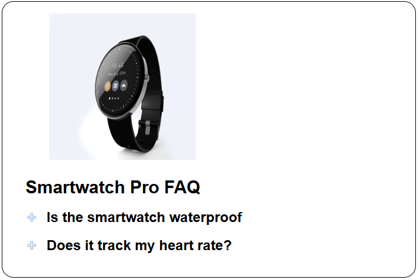
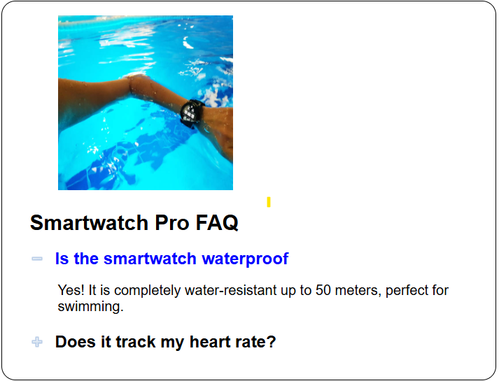

# 💻Program Details
### This program was made using:
 

### The purpose of this program is:
- Learn how to toggle panel visibility with user click.
- Learn how to store 'h2' elements inside an 'h2s' list.
- How to toggle classes on an 'h2' element using the .toggle() function.
 
 
 # 📱Program Description
> *This program toggles on between "+" or "-" when the user clicks on a subheading.👆*
> - *The pictures change depending on which heading is open!🙂.*
> - *A text box opens, detailing frequently asked question answers!🔥* 

```Opening a subheading:```



## ℹ️Image will go back to default when subheadings are closed!

## 📚Authors
👨‍🎓 **Rafael Negrete Fonseca**  
- **GitHub Profile**: [rnegrete01](https://github.com/rnegrete01)  
  


